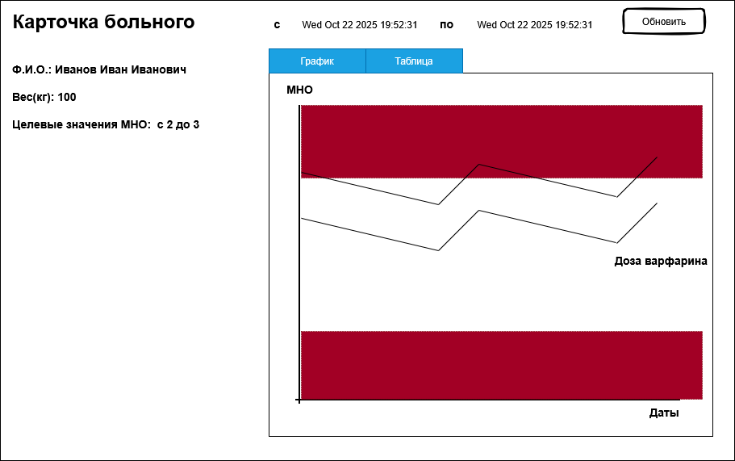
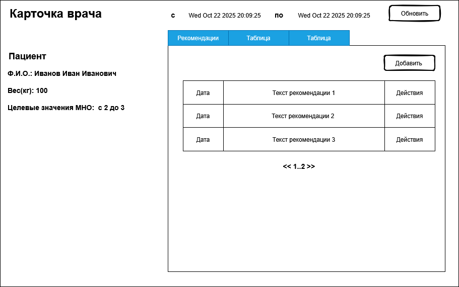

# Контроль уровня Международного Нормализованного Отношения

Международное Нормализованное Отношение (далее МНО) — это стандартизированный показатель, используемый для оценки
свертываемости крови.
Если МНО повышено, это указывает на повышенный риск кровотечений, а если понижено — на повышенный риск
тромбообразования.

Основная задача проекта - это ведение статистики соотношения дозы принимаемых антикоагулянтов и уровня МНО для больных и их
врачей. Статистика необходима для понимания влияния дозы антикоагулянтов на МНО и позволит пациенту 
скорректировать дозу самостоятельно или врачу дать рекомендации по её изменению (дозы).

## Интерфейс приложения

## Документация

1. Маркетинг и аналитика
    1. [Целевая аудитория](./docs/01-biz/01-target-audience.md)
    2. [Заинтересанты](./docs/01-biz/02-stakeholders.md)
2. Аналитика
    1. [Функциональные требования](./docs/02-analysis/01-functional-requiremens.md)
    2. [Нефункциональные требования](./docs/02-analysis/02-nonfunctional-requirements.md)
3. Архитектура
    1. ADR
    2. [Описание API](docs/03-architecture/02-api.md)
    3. Архитектурные схемы

## Структура проекта

## Подпроекты для занятий по языку Kotlin

1. Модуль 1: Введение в Kotlin
   1. [m1-init](lessons/m1-init) Первое домашнее задание 

### Плагины Gradle сборки проекта

1. [build-plugin](build-plugin) Модуль с плагинами
2. [BuildPluginJvm](build-plugin/src/main/kotlin/BuildPluginJvm.kt) Плагин для сборки проектов JVM
2. [BuildPluginMultiplarform](build-plugin/src/main/kotlin/BuildPluginMultiplatform.kt) Плагин для сборки

## Проектные модули

### Транспортные модели, API